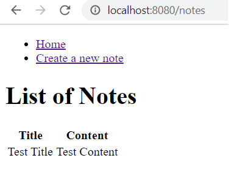

# takenotes
Note taking app using Spring Boot, Spring BootData Jpa, Spring Security,Spring Boot Validation and H2 Database.

Requirements
------------
* [Java Platform (JDK) 8](http://www.oracle.com/technetwork/java/javase/downloads/index.html)
* [Apache Maven 3.x](http://maven.apache.org/)

Quick start
-----------
1. Run the application in your editor
3. Point your browser to [http://localhost:8080/](http://localhost:8080/)

Screen shot
-----------
Login Page

Admin Home Page

List of Users

Create a new User

User Home Page

View Myself

Create a new note 

List of the notes

